# <center> **🧠 Riemannian BCI Benchmark Pipeline**

A high-performance research pipeline for Motor Imagery (MI) classification, designed to benchmark and validate Riemannian Geometry algorithms in Brain-Computer Interfaces (BCI). This project serves as a comparative laboratory to evaluate the performance of the standard `PyRiemann` library against `RiemannDSP`, a custom implementation developed in C/C++.

The pipeline features an automated "Research Engine" that orchestrates **Hyperparameter Optimization (Optuna)** and **Model Observability (MLflow)**, ensuring rigorous validation via **Leave-One-Subject-Out (LOSO)** cross-validation.

## 1. Key Points

* **Data-Driven Benchmarking:** The pipeline operates on pre-processed Tangent Space data stored in standardized HDF5 files. This allows the Python training pipeline to be agnostic to the processing backend—seamlessly consuming data whether it was processed by PyRiemann (Python) or generated externally by any other libary, e.g. RiemannDSP (C++).
* **Language-Agnostic Integration:** This pipeline is designed to be extensible. If you wish to use a custom processing library developed in another programming language (e.g., C++, Rust, MATLAB), simply ensure your output `.h5` files adhere to the HDF5 Data Schema defined in `docs/data_interface.md`. By strictly following this data contract—specifically the dataset structure and data_type metadata—this pipeline can seamlessly ingest, validate, and benchmark your external data against standard Python implementations without any code modifications.
* **Geometric Domain Adaptation:** Implements **Procrustes Alignment (PA)**. It aligns the centroids of class clusters (Transfer Learning) to map new subjects into the training manifold.
* **Cross-Validation:** Utilizes **Leave-One-Subject-Out (LOSO)** cross-validation. For a dataset of $N$ subjects, models are trained $N$ times to strictly evaluate generalization to unseen users.
* **Automated Orchestration:** An intelligent orchestrator manages **Optuna** studies to find the optimal hyperparameters for SVM, LDA and Logistic Regression models. If no multiple parameters customization is set, it can be used as a simples **Monte Carlo** experiment.
* **Full Observability:** Deep integration with **MLflow** to track:
    * **Metrics:** Macro F1-Score, Accuracy (Mean & Std Dev across subjects).
    * **Artifacts:** UMAP/PCA visualizations of the Tangent Space before and after alignment.
    * **Parameters:** Full traceability of model configs.

### Pipeline Diagram

#### Pipeline Download & Processing


#### Pipeline Training & Hyperparametrization Search

```mermaid
graph LR
    %% Styles
    classDef storage fill:#ffffff;
    classDef config fill:#ffffff;
    classDef container fill:#ffffff;
    classDef process fill:#ffffff;

    %% 1. Input
    Input[("📁 Input<br/>Tangent Space HDF5")]:::storage

    %% 2. Optimization (External)
    Optuna{{"⚡ Optuna<br/>(Suggests Hyperparameters)"}}:::config

    %% 3. Validation Block
    subgraph CV ["🔄 Cross-Validation (LOSO)"]
        direction LR
        
        PA["📐 Geometric Alignment<br/>(Procrustes / PA)"]:::process
        Train["🧠 Model Training<br/>(SVM / LDA / Logistic Regression)"]:::process
        
        %% Internal Connection
        PA --> Train
    end

    %% 4. Output
    Output[("📊 MLflow<br/>(Metric Tracking)")]:::storage

    %% Main Connections
    Input --> CV
    Optuna -.-> |"Configures"| CV
    CV --> |"Mean & Std Dev Scores"| Output
```



## 2. Project Structure

```
.
├── data/
│   ├── raw/                        # Raw EEG data downloaded from MOABB (HDF5)
│   ├── processed/                  # Tangent Space HDF5 (PyRiemann Output)
|   ├── riemanndsp/                 # Tangent Space HDF5 (RiemannDSP External Output)
│   └── optuna_db/                  # Centralized SQLite metadata
├── experiments/                    # Experiment Entry Points (Benchmarks)
│   ├── benchmark_monte-carlo.py    # Run simples Monte Carlo Benchmark
│   ├── pyriemann_benchmark.py      # Run PyRiemann Benchmark
│   ├── riemanndsp_benchmark.py     # Run RiemannDSP Benchmark
├── scripts/                        # ETL Pipelines
│   ├── export_results.py           # Export results from MLflow into .csv
│   ├── get_data.py                 # Download Raw Data (MOABB) -> Save to HDF5
│   ├── process_data.py         # Raw HDF5 -> PyRiemann -> Covariances and Tangent Space HDF5
├── src/                        # Core Library Code
│   ├── data/                   # HDF5 Data Managers (Read/Write)
│   ├── models/                 # Model Wrappers (SVM, LDA, etc.)
|   ├── processing/             # Data Transformation pipeline
│   ├── tracking/               # MLflow & Optuna Orchestration Logic
├── docs/                       # Documentation
├── .gitignore
├── pyproject.toml              # Dependency Management (uv)
└── README.md
```

## **3. Installation**

This project uses uv for fast and reproducible dependency management.

Prerequisites
* Python 3.10+


### 3.1. Setup

```
git clone https://github.com/CommanderErika/eeg-pyriemann-pipeline.git
cd eeg-pyriemann-pipeline
```

### 3.2. Install Depedencies

```
# Using uv (Recommended)
uv sync

# OR using standard pip
pip install -r requirements.txt
```

## **4. Usage Workflow**

### **4.1. Download Data & ETL**

The pipeline uses HDF5 as the common interface for data exchange.
1. Ingestion: Download datasets (e.g., Cho2017) from MOABB and save as Raw HDF5.
    * If wishes to download the dataset and save it usando Python script, use `get_data.py`.
    * All .h5 files will be saved in `/data/raw`
2. Processing (Python): Run process_data.py to calculate Covariance and Tangent Space using PyRiemann.
    * All processed .h5 files will me saved in `/data/processed`


**Commands for each step**
```
# Get data
uv run scripts/get_data.py

# Process data
uv run scripts/process_data.py 
```

### **4.2. Observability Server**
Launch MLflow to visualize experiment results in real-time. Dashboard available at: http://127.0.0.1:8080.

```
# Bash
uv run mlflow ui --host 127.0.0.1 --port 8080
```

### **4.3. Running Benchmarks**
Execute the experiment scripts. Each script points to a specific processed data path. Since both PyRiemann and RiemannDSP outputs share the same HDF5 schema, the training orchestrator processes them identically.

```
# Run Benchmark on PyRiemann Data (points to ./data/processed/ts/)
uv run experiments/pyriemann_benchmark.py

# Run Benchmark on RiemannDSP Data (points to ./data/riemanndsp/ts/)
uv run experiments/riemanndsp_benchmark.py
```

**Just to clarify, all data processed for RiemannDSP were done in C/C++ code. In the benchmark step, must have the .h5 file already in the folders, which is `/data/riemanndsp/ts/`.**

## **5. ETL Pipeline**

1. MI EEG data extracted from MOABB API.

2. Spatial Filtering: Estimation of Covariance Matrices (Corr) using PyRiemann, and saved as HDF5 files.

3. Riemannian Projection: Covariance matrices are mapped to the Tangent Space via Log-Euclidean mapping. And saved as HDF5 files.

4. Procrustes Alignment (PA) [Optional]:
    1. Calculates class centroids (Left/Right Hand) for the Test Subject and Training Set.
    2. Computes the optimal Rotation/Scale/Translation to align the Test Subject to the Training Domain (Centering -> Rotation -> Re-centering).

5. Classification: Training linear classifiers (SVM, LDA, etc.) on the aligned tangent vectors. Using LOSO Cross Validation.